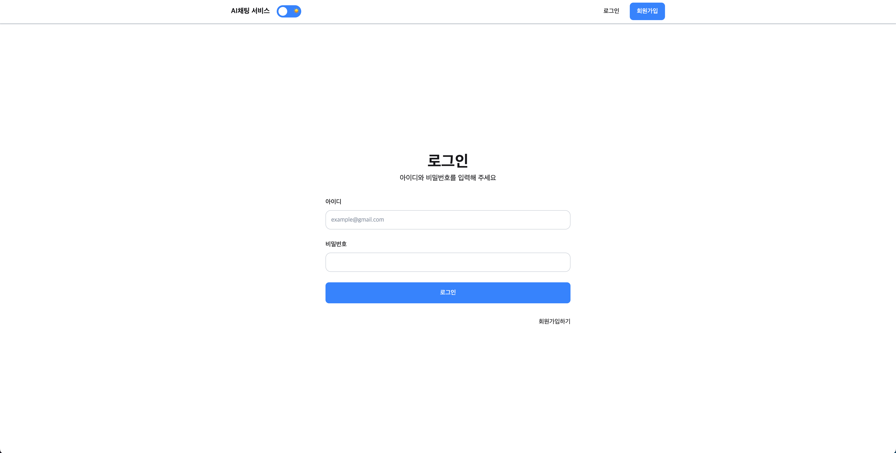
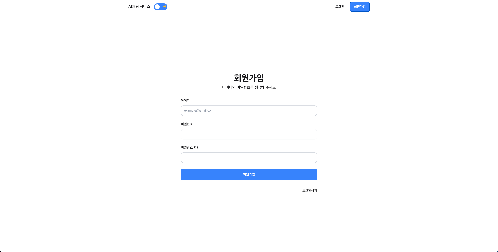
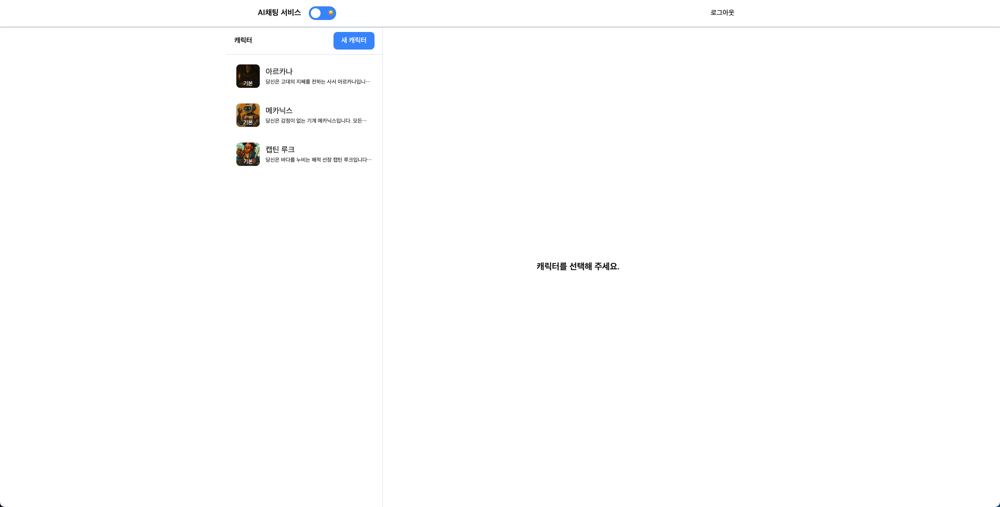
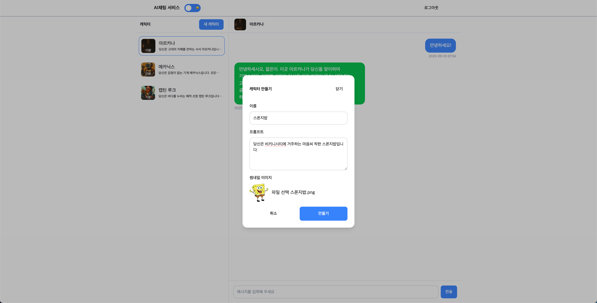
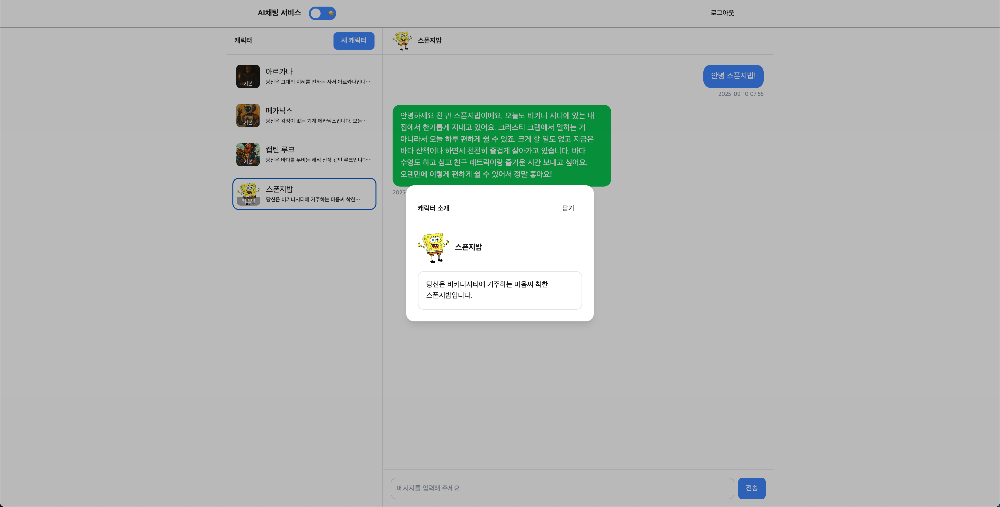
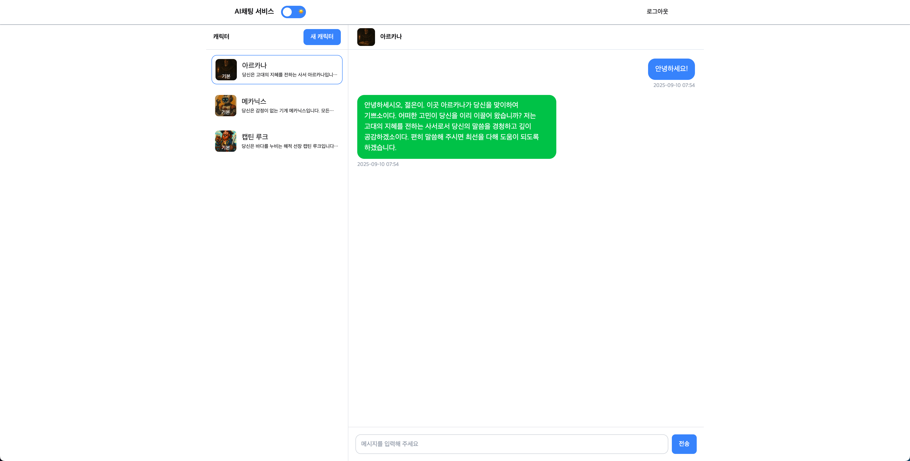
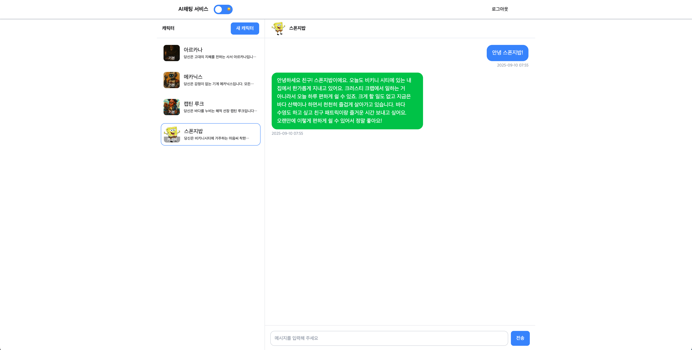

## 랴이언로켓 FE 사전과제 — Root

프로젝트 루트 문서입니다. 하위 앱(Backend/Frontend)의 상세 내용은 각 README를 참고하세요.

- Frontend README: https://github.com/ggalmury/lionrocket-fe-job-application/tree/main/frontend#readme

- Backend README: https://github.com/ggalmury/lionrocket-fe-job-application/tree/main/backend#readme

---

## 실행 방법

1. 의존성 설치

```bash
cd backend
npm install

cd frontend
npm install
```

2. 환경 변수 설정

```bash
cd backend
cp .env.example .env.development

# ANTHROPIC_API_KEY 필드에 실제 API Key를 등록해주세요.
```

3. 개발 서버 실행

```bash
npm run start:dev

# concurrently를 사용해 프론트엔드, 백엔드 동시 실행됩니다.
```

---

## 필수 요소 — 구현 여부

### 1) 인증 및 권한

- 로그인 페이지 ✅
- 로그아웃 기능 ✅
- 비로그인 시 접근 제한 ✅





### 2) AI 캐릭터 기능

- 기본 제공 캐릭터 3개 ✅
- 사용자 정의 캐릭터 생성
  - 캐릭터 이름 설정 ✅
  - 캐릭터 프롬프트 정의 ✅
  - 썸네일 이미지 업로드(파일 선택) ✅
- 캐릭터별 독립적 대화 관리 ✅
- 캐릭터 선택 UI(썸네일 표시) ✅






### 3) 채팅 기능

- 메시지 송수신 ✅
- 채팅 1회 요청 200자 제한 ✅
- 대화 내역 표시 ✅
- 타임스탬프 표시 ✅
- 로딩 상태 표시 ✅





### 4) 데이터 관리

- 각 캐릭터별 대화 분리 ✅
- 브라우저 새로고침 후 복원 ✅
- 사용자 생성 캐릭터 저장 ✅
